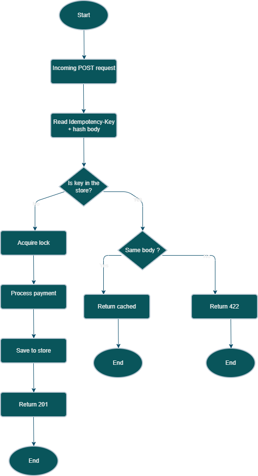

# Idempotency Gateway – FinSafe Transactions Ltd.

A payment processing API that guarantees every payment is processed **exactly once**, no matter how many times the request is retried.

---

## Architecture Diagram



## Setup Instructions

### Requirements

- Python 3.10 or later
- pip

### Steps

1. Clone the repository

```bash
git clone https://github.com/percynkgh/Idempotency-Gateway.git
cd Idempotency-Gateway
```

2. Create and activate virtual environment

```bash
python -m venv venv
venv\Scripts\activate
```

3. Install dependencies

```bash
pip install -r requirements.txt
```

4. Start the server

```bash
uvicorn main:app --reload
```

Server will be running at **http://127.0.0.1:8000**

To test the API, visit the interactive docs at: **http://127.0.0.1:8000/docs**

---

## API Documentation

### POST /process-payment

Process a payment exactly once.

#### Request Headers

| Header          | Required | Description                         |
| --------------- | -------- | ----------------------------------- |
| Idempotency-Key | Yes      | A unique string per payment attempt |
| Content-Type    | Yes      | application/json                    |

#### Request Body

```json
{
  "amount": 100,
  "currency": "GHS"
}
```

#### Scenario 1 - First Request

```bash
curl -X POST http://127.0.0.1:8000/process-payment \
  -H "Idempotency-Key: order-001" \
  -H "Content-Type: application/json" \
  -d '{"amount": 100, "currency": "GHS"}'
```

Response - 200 OK

```json
{
  "status": "success",
  "message": "Charged 100.0 GHS"
}
```

#### Scenario 2 - Duplicate Request (same key, same body)

Same request as above sent again.

Response - 200 OK

```json
{
  "status": "success",
  "message": "Charged 100.0 GHS"
}
```

#### Scenario 3 - Different Body, Same Key

```bash
curl -X POST http://127.0.0.1:8000/process-payment \
  -H "Idempotency-Key: order-001" \
  -H "Content-Type: application/json" \
  -d '{"amount": 500, "currency": "GHS"}'
```

Response - 422 Unprocessable Entity

```json
{
  "detail": "Idempotency key already used for a different request body."
}
```

---

## Design Decisions

### Language and Framework - Python and FastAPI

FastAPI was chosen because it handles request validation automatically through Pydantic. If a request is missing the amount or currency fields, it is rejected before reaching the business logic.

### In-Memory Store - Python Dictionary

The store is a plain Python dictionary. It is simple, fast, and sufficient for this project. In a real production system this would be replaced with Redis to support multiple server instances.

### Body Fingerprinting - SHA-256 Hash

The request body is converted to a SHA-256 hash before storage. This makes comparison fast and consistent. The keys are sorted before hashing so the order of fields in the JSON does not affect the result.

### Race Condition Handling - Threading Lock

Each idempotency key gets its own threading lock. When two requests arrive at the same time with the same key, only one can enter at a time. The second request waits for the first to finish and then returns the cached result instead of processing a new payment.

---

## Developer's Choice - TTL Expiry

### What it is

Every record saved in the store includes a timestamp. When a request comes in, the system checks if the existing record is older than 24 hours. If it is, the record is deleted and the request is treated as a fresh payment.

### Why it matters

Without expiry, the store grows forever. In a real payment system, clients are expected to retry within a reasonable window. After 24 hours, a key is no longer needed. This matches how real payment processors like Stripe handle idempotency keys and prevents unbounded memory growth in production.

---

## Running the Race Condition Test

```bash
python test_race.py
```

This fires two simultaneous requests with the same key and confirms both receive identical responses, proving the payment was only processed once.
